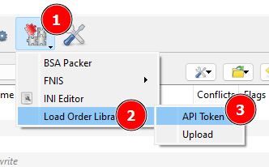
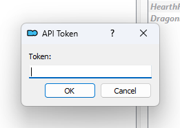
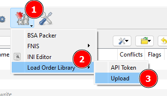
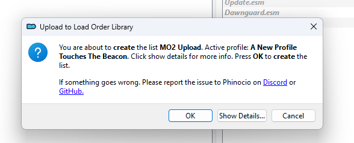
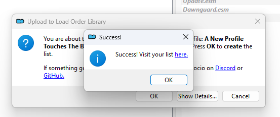

# Load Order Library MO2 Plugin

The purpose of this plugin is to use the Load Order Library API to allow Mod Organizer 2 users to upload/update their currently selected to Load Order Library. It gets the current game MO2 is managing and uploads the currently selected profile.

For now, I'm only comfortable saying Bethesda games are "officially" supported, I have no idea how the other games work with MO2, please report any issues with any games you come across! That said, the plugin should auto detect whatever game is being managed.

> **NOTE**: The plugin assumes you use profile specific ini files.

# Settings

Use the plugin settings in MO2 to configure things like the list name, version, private, etc.
The defaults are as follows:

| Setting              | Default                 | Note                                            |
| -------------------- | ----------------------- | ----------------------------------------------- |
| list_name            | My List                 | The name of your list.                          |
| list_version         | 0.0.1                   | The verison.                                    |
| list_description     |                         | A short description of the list, optional.      |
| list_website         |                         | The website for the list, if it has one.        |
| list_discord         |                         | Discord for list support.                       |
| list_readme          |                         | The list's readme file.                         |
| list_private         | False                   | If the list is private or not.                  |
| upload_files         | modlist.txt,plugins.txt | What files will be uploaded.                    |
| version_auto_parsing | False                   | Attempt to auto parse version from a separator. |

For files to upload, add them separated by a comma like the default. A list requires at least one file to be uploaded.

# A Caveat with Profiles

The plugin does not currently support uploading profiles as separate lists if using an API token. Whatever profile you have active at the time is what will replace the list the plugin is tracking.

# Usage

## API Token

Using an API token is only necessary if you want to update lists. To get one, please see the relevant Docs section https://docs.loadorderlibrary.com/en/authentication. I recommend creating a token with `Create` and `Update` abilities if you plan to use it with this plugin.

Without an API token, every single upload will create a new list as updating anonymous lists is not possible.

After getting an API Token, open up the input dialog following the steps in the image below.

After it opens, paste your token and click ok.

That's it! Uploads should now create the list on first upload, and then update it afterwards.

# Slug

If you want to manage an existing list, copy the slug (the part after `lists/` in the url), then follow the same steps as adding an API Token, but click "Set slug" instead.

## Uploading a list

To upload a list, follow the steps in the image below.

Once you click on `Upload`, a dialog will pop up asking for confirmation and giving you some detail on what is being uploaded.

> NOTE: If you have already uploaded a list with the plugin, `create` text will say `update`.

Once successful, there will be a pop up with a clickable link to view the list.

If there is an error, it will instead show a dialog of what the error was. Normally it's either an incorrectly pasted token, or one created without the proper abilities.

If you are using an API Token, future uploads will _update_ the list you just created.

# Installation

Extract the folder in the archive to `%MO2DIR%/plugins` such that it becomes `%MO2DIR%/plugins/lolmo2plugin`

# Known Issues/Limitation

Currently, if one wants to upload a list without a version and they remove the defualt, lists will be uploaded with a version of `None`.
